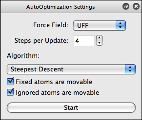

# AutoOptimization Tool

 The AutoOptimization tool allows you to optimize the geometry of a molecule while manipulating it (e.g., continuing to use the Draw tool).

In general, the default settings should be sufficient for most users:

-   Force Field: UFF or MMFF94
-   Steps per Update: 4
-   Algorithm: Steepest Descent

If you have a slower computer, consider decreasing the number of steps per update.

Once started, the optimization will occur in the background while you continue to work. You can also left click on an atom to manipulate it during the optimization.

Settings
--------

<Category:Tools>

