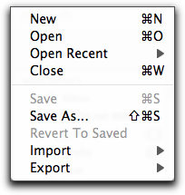
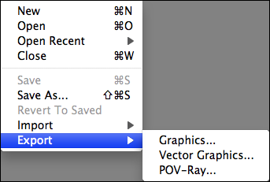

# File Menu

New
---

Open
----

Open Recent
-----------

A list of the most recently-opened files.

Close
-----

Save
----

Save As...
----------

Revert To Saved
---------------

Import
------

### Molecule File...

### Trajectory...

### Fetch from PDB...

Type a PDB ID to import from the Protein Data Bank, www.pdb.org

### Fetch chemical structure...

Type in a chemical name to search <http://cactus.nci.nih.gov/chemical/structure> for structures.

### Fetch from URL...

Export
------

### Graphics...

Saves a bitmap graphics file of the current scene in BMP, PNG, JPEG, or GIF format.

### Vector Graphics...

Saves a PDF, PostScript, or SVG version of the current scene.

### POV-Ray

Saves a file and optionally runs the [POV-Ray](http://www.povray.org/) ray-tracing program to produce a high-quality image suitable for a poster or other purposes.

Quit
----

Exits Avogadro, closing any open documents.

<Category:Menus>

