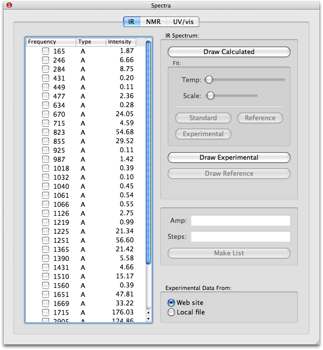

# Spartan

[Spartan](http://www.wavefun.com/products/spartan.html) is a series of commercial products from [Wavefunction, Inc.](http://www.wavefun.com/) aimed at user-friendly computational chemistry, particularly in the education market.

A number of features in Spartan are particularly interesting for Avogadro, including the ability to plot calculated spectra against experimental -- by downloading the spectra over the internet. (Presumably, Wavefunction has gathered an internal database of spectra, since no open spectra database exists.)

For computations, Spartan includes its own molecular mechanics implementation (based on MMFF94 and UFF) and semiempirical (presumably based on MOPAC). For more advanced calculations, Spartan internally includes a copy of Q-Chem.

### Infrared

It is not clear how one would plot Raman spectra.

### NMR

Evidently, Spartan also includes code which estimates peak-splitting patterns.

### UV/Vis

Although not stated, Spartan also evidently includes ZINDO calculations for UV/Vis spectra, as well as interpretation of HF/CIS and TDDFT calculations to produce computed UV/Vis spectra.

<Category:Inspiration>

