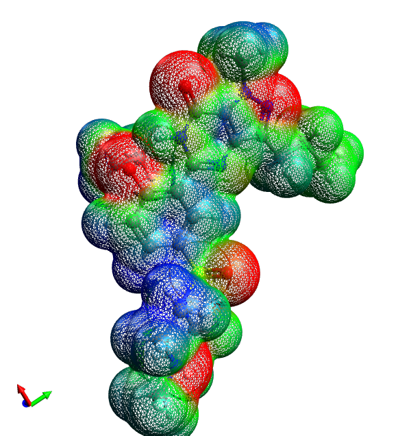

# Surface

The surface display generates the full van der Waals or solvent-accessible surface of the molecule. The surface can be colored with a custom color or mapped to a property. By default, the property map reflects the electrostatic potential (i.e., the positive and negative charges) of the molecule.

### Settings

-   Opacity
-   Style: Lines, Points, or Filled
-   Color: Electrostatic potential, or custom color
-   Clipping plane

### Screenshot

<Category:Display>

