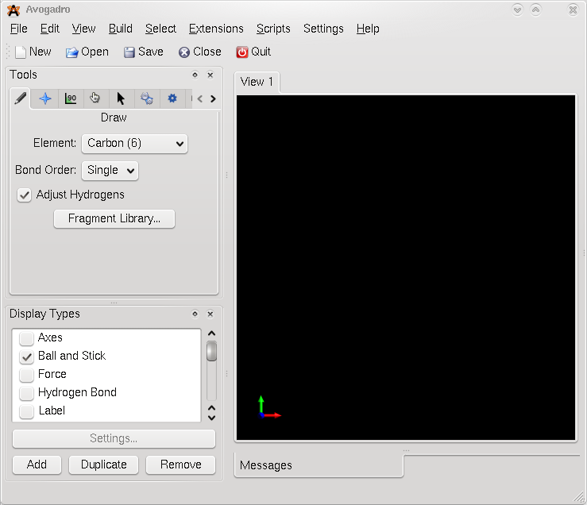
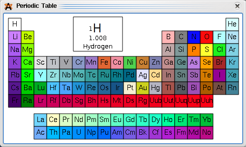

# Tutorials:Drawing molecules

When you open Avogadro without loading a file it defaults to using the [Draw Tool](Draw Tool "wikilink"). This tool is the main one that will be used when drawing a new molecule. The screen shot below shows Avogadro 0.8.1 (without the Python terminal) on KDE 4.1. The tool dock is located in the top of the left hand of the interface denoted by the pencil icon.

You can select the element you would like to use by clicking on the drop down menu which says 'Carbon (6)' on the screen shot. Common elements are in the drop down, if the element you would like to use is not in that list then selecting 'Other...' will bring up a full periodic table.

Left clicking once on an element will bring up more details of the element in the bigger box in the top middle. Double clicking an element will select the element and close the periodic table. You can also keep the periodic table open and click on the element you wish to use, clicking on the central OpenGL view will use the currently selected element.

Drawing
-------

Once you have selected an element you can left click on the black (currently empty) view. This will place one atom of the element you selected under the mouse cursor. If the 'Adjust Hydrogens' option is checked then the appropriate number of hydrogens will be added to the molecule for normal valence. Removing the check from the box will stop this from being done.

Deletion
--------

If you find you have made a mistake or wish to delete a particular atom then right clicking on the atom (or bond) will delete it. Note that if 'Adjust Hydrogens' is checked then you cannot delete the added hydrogens as the adjust hydrogens function adjusts the number of hydrogens automatically and so adds the deleted hydrogen back.

Building Molecules
------------------

To actually build up a complete molecule you will likely want to draw something more complex. Left clicking on an existing atom, keeping the mouse button pressed and dragging to another location will create a bond between the existing atom and the new one. The bond order can be selected in the 'Bond Order' drop down. Alternatively clicking on bonds will adjust their order (single, double, triple, single).

If you need to change an existing atom so that it is another element simply select the desired element and click on the existing atom. With adjust hydrogens that can be used to 'grow' molecules by changing the hydrogens. It is possibly to build up many structures using these tools.

Avogadro also has a 'Fragment Library' which allows you to browse through a list of molecular fragments, choose one and insert it into the current molecule.

Optimizing the Geometry
-----------------------

Avogadro has three force fields available which can be used to optimize the structure of the molecules drawn. It defaults to use one called MMFF94 which can handle most common organic structures. If you have used transition metals you might want to use UFF which can handle every element. Simply clicking on 'Extensions-\>Optimize Geometry' is usually enough to give you a reasonably well optimized structure. The settings of the force field can be altered by going to 'Extensions-\>Molecular Mechanics-\>Setup Force Field...'

The above image shows a molecule drawn using the [Draw Tool](Draw Tool "wikilink") and then optimized using the default settings of the force field to optimize the geometry of the molecule.

Manipulating Molecules
----------------------

You don't always get it right the first time around, or perhaps the geometry optimization has not given you the geometry you are interested in. Avoogadro has two tools to help with manipulating molecules that have already been drawn. These are the [Bond Centric Manipulate Tool](Bond Centric Manipulate Tool "wikilink") and the [Manipulate Tool](Manipulate Tool "wikilink"). They both allow you to manipulate an existing molecule.

Many tools can work on either the atom clicked on or on a selection of atoms. The [Select Tool](Select Tool "wikilink") allows you to make selections and then work on these selections using a different tool. For example a group of five atoms can be selected using the [Select Tool](Select Tool "wikilink") and then those atoms can be moved by selecting the [Manipulate Tool](Manipulate Tool "wikilink") and left clicking the selection while moving the mouse until the desired configuration is obtained.

Undo/Redo
---------

Avogadro supports undo/redo. All draw operations can be undone and redone by using the appropriate menu items in the edit menu. If you ever make a mistake simply select 'Edit-\>Undo' (or Ctrl+Z).

Saving
------

Once you are satisfied with the molecule you have drawn you can save it using the 'File-\>Save As...' menu item. A large array of file formats are offered. If no extension is supplied Avogadro will default to using CML which is a good default if you are not sure what format to use.

<Category:Tutorials>

