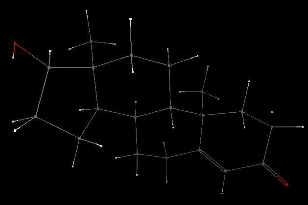

# Wireframe

The wireframe view draws a thin line for bonds and a small square dot for atoms.

### Settings

-   Atoms can optionally be shown or hidden.
-   Multiple bonds can optionally be shown.

### Screenshot

<Category:Display>

